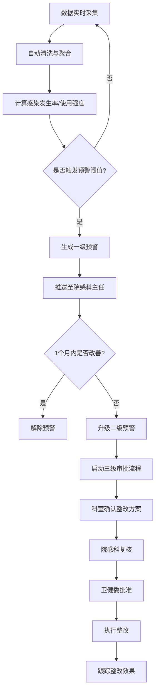
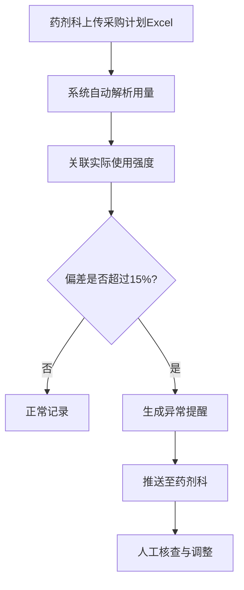
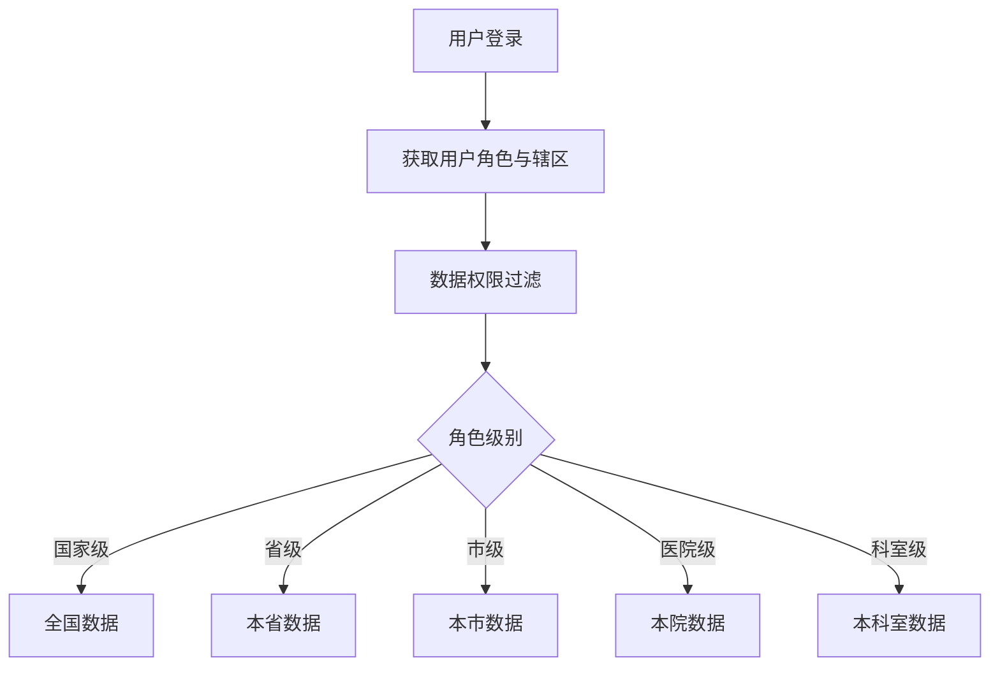

## 1. 产品概述

全国性医院感染监测与抗菌药物使用分析平台，实时接入全国各级医院感染病例、抗菌药物使用数据及细菌培养数据，通过智能分析与预警机制，辅助院感管理决策，提升抗菌药物合理使用水平。

- **核心价值**：实现全国医院感染数据的实时监测、智能预警和科学决策
- **目标用户**：国家卫健委、省级卫健委、市级卫健委、医院院感科、药剂科、临床科室
- **解决问题**：院感数据分散、监测滞后、预警不及时、抗菌药物使用不合理

## 2. 核心功能

### 2.1 用户角色

| 角色 | 注册方式 | 核心权限 |
|------|----------|----------|
| 国家级管理员 | 系统预置 | 查看全国数据、管理省级用户、生成全国报告 |
| 省级管理员 | 上级创建 | 查看本省数据、管理市级用户、生成本省报告 |
| 市级管理员 | 上级创建 | 查看本市数据、管理医院用户、生成本市报告 |
| 医院管理员 | 上级创建 | 查看本院数据、管理科室用户、处理预警 |
| 院感科主任 | 医院创建 | 查看本院数据、处理预警、审批整改方案 |
| 药剂科主任 | 医院创建 | 查看药物使用数据、管理采购计划、处理异常提醒 |
| 科室主任 | 医院创建 | 查看本科室数据、确认整改方案 |

### 2.2 功能模块

1. **核心看板**：全国感染热力图、抗菌药物使用排名、省份下钻、趋势曲线
2. **数据接入**：实时数据接入、自动清洗、多维度聚合
3. **预警管理**：一级预警、二级预警、三级审批流程
4. **采购计划**：Excel上传、用量提取、偏差分析、异常提醒
5. **报告中心**：周度自动报告、同比环比分析、优化建议
6. **系统管理**：用户管理、权限管理、医院管理

### 2.3 页面详情

| 页面名称 | 模块名称 | 功能描述 |
|----------|----------|----------|
| 登录页 | 登录表单 | 账号密码登录、角色选择、权限验证 |
| 核心看板 | 数据概览卡片 | 感染发生率、药敏达标率、使用强度等核心指标 |
| 核心看板 | 全国热力图 | 按省份展示感染率分布，支持点击下钻 |
| 核心看板 | 医院/科室排名 | 抗菌药物使用强度排名、感染率排名 |
| 核心看板 | 趋势曲线 | 近7天/30天感染趋势、药物使用趋势 |
| 核心看板 | 药物类别分布 | 各类抗菌药物使用占比 |
| 预警中心 | 预警列表 | 一级/二级预警列表、状态筛选 |
| 预警中心 | 预警详情 | 预警原因、历史数据、整改记录 |
| 预警中心 | 三级审批 | 科室确认、院感科复核、卫健委批准 |
| 采购计划 | 计划列表 | 年度采购计划管理 |
| 采购计划 | Excel上传 | 批量导入采购计划、自动解析 |
| 采购计划 | 偏差分析 | 计划与实际使用对比、异常提醒 |
| 报告中心 | 报告列表 | 周度报告、月度报告、年度报告 |
| 报告中心 | 报告详情 | 感染发生率同比环比、药敏达标率、药物排名、优化建议 |
| 系统管理 | 用户管理 | 用户增删改查、角色分配 |
| 系统管理 | 医院管理 | 医院信息维护、等级设置 |

## 3. 核心流程

### 3.1 预警与审批流程

### 3.2 采购计划流程

### 3.3 权限数据隔离流程

## 4. 用户界面设计

### 4.1 设计风格

- **主色调**：医疗蓝 (#165DFF) 作为主色，体现专业、可信的医疗属性
- **辅助色**：健康绿 (#00B42A) 表示正常，警示橙 (#FF7D00) 表示预警，危险红 (#F53F3F) 表示严重
- **中性色**：深灰 (#1D2129) 文字，中灰 (#4E5969) 次级文字，浅灰 (#C9CDD4) 边框
- **整体风格**：专业医疗风格，简洁大气，数据可视化突出
- **卡片风格**：圆角8px，轻微阴影，白色背景
- **字体**：使用系统无衬线字体，标题加粗，数据使用等宽数字

### 4.2 页面设计概览

| 页面名称 | 模块名称 | UI元素 |
|----------|----------|--------|
| 登录页 | 登录表单 | 左侧品牌展示区，右侧登录表单，医疗蓝主色调 |
| 核心看板 | 顶部导航 | Logo、导航菜单、用户信息、消息通知 |
| 核心看板 | 数据概览 | 4个核心指标卡片，带趋势箭头和同比变化 |
| 核心看板 | 热力图区域 | 中国地图热力图，右侧图例，支持悬浮提示 |
| 核心看板 | 排名列表 | 可切换医院/科室排名，带进度条 |
| 核心看板 | 趋势图表 | 折线图/柱状图，支持时间范围切换 |
| 预警中心 | 预警卡片 | 分级颜色标识，预警等级、时间、科室、原因 |
| 预警中心 | 审批流程 | 步骤条展示审批进度，操作按钮 |
| 采购计划 | 上传区域 | 拖拽上传，Excel模板下载 |
| 采购计划 | 偏差对比 | 柱状对比图，异常标红 |
| 报告中心 | 报告卡片 | 报告周期、核心指标摘要、生成时间 |
| 报告中心 | 报告详情 | 多图表布局，文字分析建议 |

### 4.3 响应式设计

- 桌面端优先设计，采用1440px基准宽度
- 支持1200px、1024px等常见分辨率自适应
- 侧边导航在小屏幕可折叠
- 数据表格支持横向滚动
- 图表组件支持响应式重绘

### 4.4 数据可视化设计

- **热力图**：使用蓝-黄-红渐变色带表示感染率从低到高
- **趋势图**：使用平滑折线，关键数据点高亮
- **排名图**：横向条形图，前三名使用特殊颜色标识
- **饼图/环形图**：用于药物类别分布，支持图例交互
- **仪表盘**：用于展示达标率，不同区间使用不同颜色
