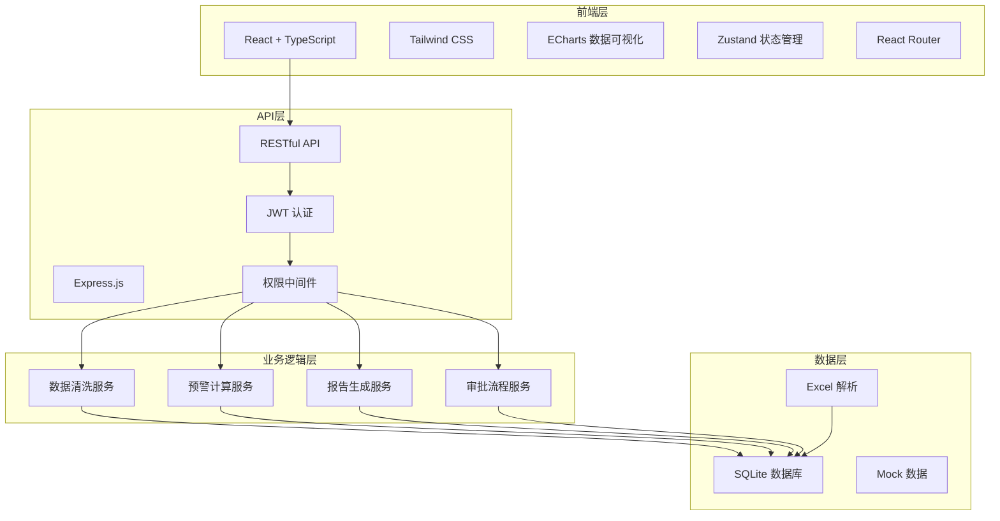
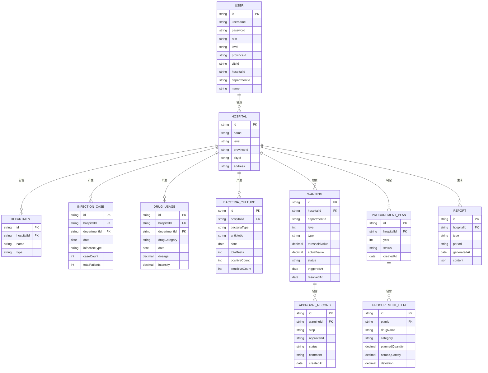

## 1. 架构设计



## 2. 技术说明

- **前端**：React@18 + TypeScript + Vite
- **样式**：Tailwind CSS@3
- **状态管理**：Zustand
- **路由**：React Router DOM
- **图表库**：ECharts（热力图、折线图、柱状图、饼图等）
- **图标库**：Lucide React
- **后端**：Express@4 + TypeScript
- **数据库**：SQLite（轻量级，便于演示）
- **认证**：JWT Token
- **Excel处理**：xlsx库

## 3. 路由定义

| 路由 | 页面 | 说明 |
|------|------|------|
| /login | 登录页 | 用户登录入口 |
| /dashboard | 核心看板 | 全国感染数据总览 |
| /warnings | 预警中心 | 预警列表与审批流程 |
| /procurement | 采购计划 | 抗菌药物采购计划管理 |
| /reports | 报告中心 | 周度/月度/年度报告 |
| /system/users | 用户管理 | 用户与权限管理 |
| /system/hospitals | 医院管理 | 医院信息维护 |

## 4. API 定义

### 4.1 认证接口

```typescript
// 登录
POST /api/auth/login
Request: { username: string; password: string }
Response: { token: string; user: User }

// 获取当前用户信息
GET /api/auth/me
Response: { user: User }
```

### 4.2 看板数据接口

```typescript
// 获取概览数据
GET /api/dashboard/overview
Response: {
  infectionRate: number;
  drugSusceptibilityRate: number;
  usageIntensity: number;
  warningCount: number;
  infectionRateYoY: number;
  infectionRateMoM: number;
}

// 获取省份感染数据
GET /api/dashboard/provinces
Response: ProvinceData[]

// 获取医院排名
GET /api/dashboard/ranking?type=infection|usage&page=1&size=10
Response: { list: HospitalRank[]; total: number }

// 获取趋势数据
GET /api/dashboard/trend?days=7&provinceId=xxx
Response: TrendData[]

// 获取药物类别分布
GET /api/dashboard/drug-categories
Response: DrugCategory[]
```

### 4.3 预警接口

```typescript
// 获取预警列表
GET /api/warnings?level=1|2&status=pending|processing|resolved&page=1&size=10
Response: { list: Warning[]; total: number }

// 获取预警详情
GET /api/warnings/:id
Response: WarningDetail

// 提交整改方案
POST /api/warnings/:id/rectification
Request: { plan: string; departmentConfirm: boolean }

// 院感科复核
POST /api/warnings/:id/review
Request: { approved: boolean; comment: string }

// 卫健委批准
POST /api/warnings/:id/approve
Request: { approved: boolean; comment: string }
```

### 4.4 采购计划接口

```typescript
// 获取采购计划列表
GET /api/procurement?year=2024&page=1&size=10
Response: { list: ProcurementPlan[]; total: number }

// 上传Excel
POST /api/procurement/upload
FormData: { file: File; year: number; hospitalId: string }
Response: { imported: number; deviations: DeviationItem[] }

// 获取偏差分析
GET /api/procurement/deviation?id=xxx
Response: DeviationAnalysis
```

### 4.5 报告接口

```typescript
// 获取报告列表
GET /api/reports?type=weekly|monthly|yearly&page=1&size=10
Response: { list: Report[]; total: number }

// 获取报告详情
GET /api/reports/:id
Response: ReportDetail

// 生成报告
POST /api/reports/generate
Request: { type: string; period: string }
Response: { reportId: string }
```

## 5. 数据模型

### 5.1 数据模型ER图



### 5.2 数据初始化说明

- 预置国家级、省级、市级、医院级测试账号
- 预置全国31个省份基本数据
- 预置约50家各级医院模拟数据
- 生成近3个月的感染病例、药物使用、细菌培养数据
- 预置若干预警记录和审批记录
- 预置年度采购计划数据
- 预置若干周报、月报数据

## 6. 目录结构

```
src/
├── components/          # 通用组件
│   ├── Layout/         # 布局组件
│   ├── Chart/          # 图表组件
│   ├── Table/          # 表格组件
│   └── Card/           # 卡片组件
├── pages/              # 页面
│   ├── Login/          # 登录页
│   ├── Dashboard/      # 核心看板
│   ├── Warnings/       # 预警中心
│   ├── Procurement/    # 采购计划
│   ├── Reports/        # 报告中心
│   └── System/         # 系统管理
├── hooks/              # 自定义hooks
├── store/              # Zustand状态
├── utils/              # 工具函数
├── types/              # TypeScript类型
├── api/                # API请求
├── App.tsx
└── main.tsx

api/                    # 后端代码
├── src/
│   ├── controllers/    # 控制器
│   ├── services/       # 业务逻辑
│   ├── models/         # 数据模型
│   ├── middleware/     # 中间件
│   ├── routes/         # 路由
│   ├── utils/          # 工具函数
│   ├── db/             # 数据库
│   └── index.ts
└── package.json
```
